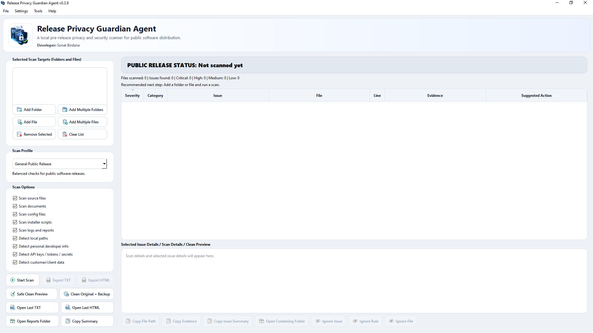
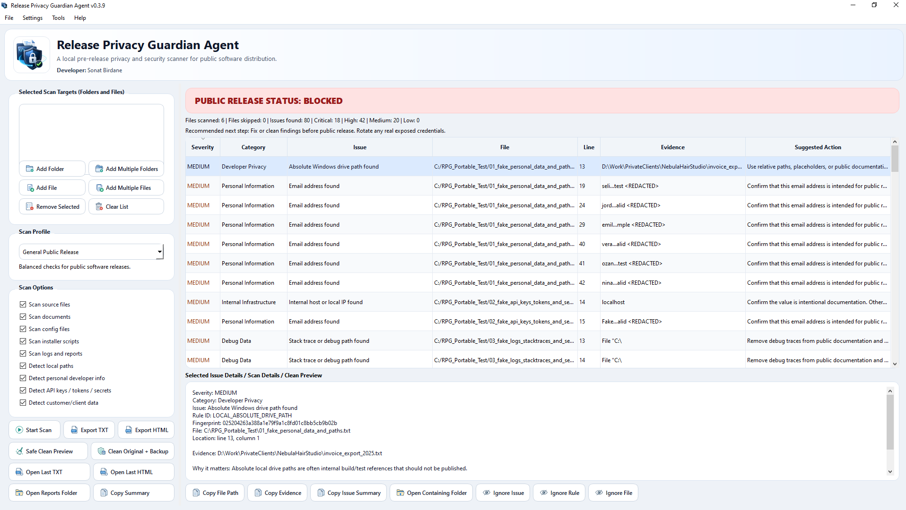
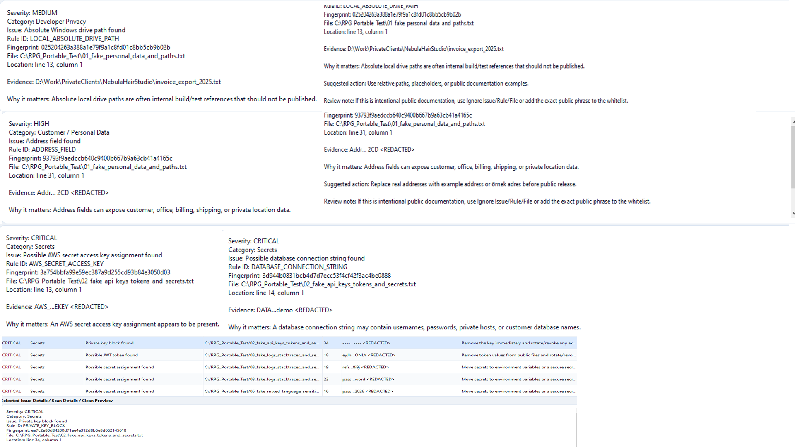
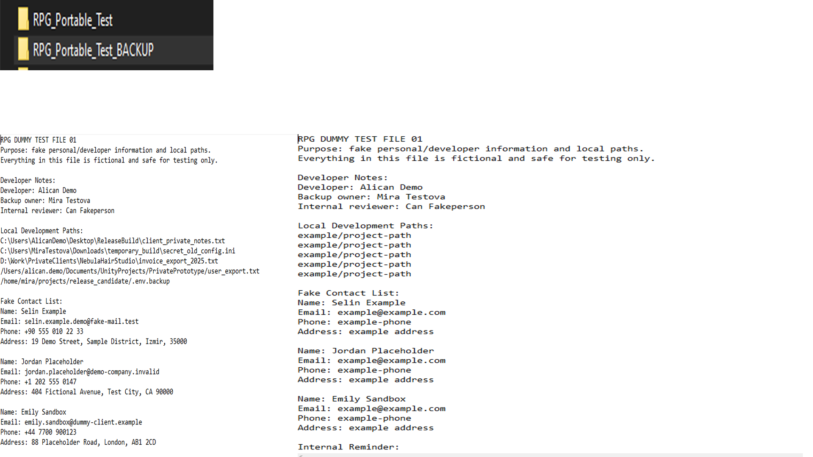

# Release Privacy Guardian Agent

**Release Privacy Guardian Agent** is a local pre-release privacy and security scanner for developers, indie tool makers, public GitHub projects, installer packages, small business tools, and 3D/game pipeline utilities.

It helps you review a project before publishing it by scanning for private paths, exposed credentials, API keys, tokens, personal/developer information, customer/client data, risky release files, logs, backups, installer mistakes, and other public-release hygiene risks.

> **Important:** This tool is a practical safety helper, not a guarantee. It is developed by a single independent developer and may produce false positives, false negatives, or missed cases. Always perform a final manual review before publishing anything publicly.

---

## Key Features

- Local-only scanning
- No internet connection required for scanning
- Folder and direct file target support
- Multiple scan profiles for different release types
- Pattern-based privacy, security, and release hygiene detection
- Secret/token/API key detection
- Local Windows/macOS/Linux path detection
- Personal/developer information detection
- Customer/client/business data detection
- Multilingual business/customer field detection
- Installer and package hygiene checks
- Risk-based release status: `PASSED`, `WARNING`, or `BLOCKED`
- Detailed issue review panel
- TXT and HTML report export
- False-positive controls
- Whitelist support
- Safe Clean Preview
- Clean Original + Backup workflow
- Public-friendly replacement values
- Backup-first cleanup behavior

---

## Screenshots

The following screenshots show the main interface, scan workflow, blocked release status, issue review panel, clean preview, and backup behavior of **Release Privacy Guardian Agent**.

<p align="center">
  
  <br>
  <sub>Main Dashboard / Not Scanned Yet — 1920 × 1080 px</sub>
</p>

<p align="center">
  
  <br>
  <sub>Blocked Scan Result / Findings Table — 1916 × 1080 px</sub>
</p>

<p align="center">
  
  <br>
  <sub>Issue Details / Critical Findings Review — 1920 × 1080 px</sub>
</p>

<p align="center">
  
  <br>
  <sub>Safe Clean Preview / Before and After Cleanup — 1920 × 1080 px</sub>
</p>

---

## What It Checks

Release Privacy Guardian Agent can detect many types of release risks, including:

### Developer Privacy

- Local Windows user paths
- Local Unix/macOS home paths
- Absolute Windows drive paths
- Loose or typo-prone local paths
- Local machine names
- Private developer references
- Debug paths and stack trace paths

### Secrets and Credentials

- Generic secret assignments
- Password assignments
- API key assignments
- Token assignments
- Bearer tokens
- JWT-shaped tokens
- Private key blocks
- Certificate blocks
- Cookie/session/auth values
- Database connection strings
- Risky credential/key filenames

### Platform-Specific Secret Patterns

- OpenAI-style API keys
- Anthropic / Claude API keys
- Google Cloud / Gemini / Firebase-style API keys
- GitHub tokens
- GitLab tokens
- AWS access keys
- AWS secret access key assignments
- Stripe secret/restricted keys
- Slack tokens and webhooks
- Discord webhook URLs
- SendGrid API keys
- Twilio SID/auth token patterns
- Cloudflare token assignments
- Azure client secret assignments
- Hugging Face tokens
- Replicate tokens
- npm tokens
- PyPI tokens

### Customer / Client / Business Data

The scanner includes English and Turkish customer/business terms, plus multilingual field-label support for Chinese, Traditional Chinese, Japanese, Korean, French, German, Italian, Spanish, and Portuguese.

It can flag fields such as:

- Customer/client/person name
- Company/business name
- Address
- Billing address
- Shipping address
- Delivery address
- Phone/mobile/contact number
- Tax/VAT/company registration number
- National ID/passport/document number
- Invoice number
- Order number
- Booking/reservation/appointment identifier
- Private customer note
- Internal business note
- Postal/ZIP code
- Bank account/IBAN
- Birth date
- Customer export filenames

### Release Hygiene

- `.env` files
- Database files
- Log files
- Temporary files
- Backup files
- Crash dumps
- Customer export files
- Installer/build references
- Risky release artifacts
- Debug output
- Internal report files

---

## Scan Profiles

Release Privacy Guardian Agent includes several profiles for different public-release scenarios.

### General Public Release

Balanced default mode for public release candidates.

### Python Desktop App

Extra attention to Python applications, logs, packaged builds, source files, and configuration files.

### Installer Package

Focuses on installer scripts, setup files, batch files, PowerShell files, release folders, and package hygiene.

### Business / Client Software

Stricter checks for customer/client data, invoices, phone numbers, addresses, orders, appointments, and business records.

### Game / 3D Pipeline Tool

Extra checks for Maya, Autodesk, Unreal, Unity, FBX, Content, Assets, texture sources, and local pipeline path patterns.

### Strict Privacy Audit

The most aggressive scan mode. More false positives are expected. Recommended before final public release.

---

## Scan Options

Users can enable or disable broad scan categories from the interface:

- Scan source files
- Scan documents
- Scan config files
- Scan installer scripts
- Scan logs and reports
- Detect local paths
- Detect personal developer info
- Detect API keys / tokens / secrets
- Detect customer / client data

---

## Release Status Levels

After each scan, the tool summarizes the public-release status.

### PASSED

No blocking issues were found based on the selected rules and options.

### WARNING

Non-blocking issues were found. Review before release.

### BLOCKED

High or Critical issues were found. Public release should not proceed until the findings are reviewed and resolved.

---

## Severity Levels

### LOW

Minor release hygiene issue.

### MEDIUM

Internal configuration, infrastructure, or possible data exposure that should be reviewed.

### HIGH

Developer privacy, customer data, local path, personal email, or significant release risk.

### CRITICAL

Secret, token, private key, credential, or comparable release blocker.

---

## Basic Usage

### Folder Scan

1. Open the program.
2. Click **Add Folder** or **Add Multiple Folders**.
3. Select the project folder or folders you want to review.
4. Choose a scan profile.
5. Click **Start Scan**.
6. Review the `PASSED`, `WARNING`, or `BLOCKED` status.
7. Select findings to inspect full details.
8. Export TXT or HTML reports if needed.

### File Scan

1. Open the program.
2. Click **Add File** or **Add Multiple Files**.
3. Select one or more files to review.
4. Choose a scan profile.
5. Click **Start Scan**.
6. Review any findings.

---

## Issue Review Panel

Selecting a finding shows detailed information such as:

- Severity
- Category
- Issue name
- Rule ID
- Fingerprint
- File path
- Line and column
- Evidence
- Why it matters
- Suggested action
- Review note

The interface also includes copy/open actions for issue details, file paths, evidence, and summaries.

---

## False Positive Controls

Some findings may be intentional public examples or approved documentation text. The tool includes controls for reviewing and suppressing known-safe results.

### Ignore Issue

Ignores only one exact finding fingerprint.

### Ignore Rule

Ignores all findings from the selected rule.

### Ignore File

Ignores all findings from the selected file.

Use ignore actions carefully. Do not ignore findings only to force a clean status.

---

## Whitelist

The whitelist is for exact public phrases that should be treated as safe in your own project context.

Good whitelist examples:

- Public company name
- Public product name
- Public support contact
- Public documentation example phrase

Avoid adding real secrets, private emails, private customer names, internal path fragments, or sensitive business data to the whitelist.

---

## Safe Clean Preview

**Safe Clean Preview** shows planned replacement/removal actions without modifying files.

Always review this preview carefully before using **Clean Original + Backup**.

---

## Clean Original + Backup

The cleanup workflow creates a backup first, then modifies the selected original target in place.

### Folder Target Behavior

```text
Original:
<PROJECT_FOLDER>

Backup:
<PROJECT_FOLDER>_BACKUP
```

### Direct File Target Behavior

```text
Original:
<PROJECT_FOLDER>/config.txt

Backup:
<PROJECT_FOLDER>_BACKUP/ONLYFILES/config.txt
```

Direct file backup intentionally stays outside the release folder to reduce the risk of accidentally publishing backup files next to cleaned files.

If the backup already exists, a timestamp is appended.

---

## Public-Friendly Replacement Values

Clean operations use public-friendly example values instead of harsh placeholder text.

Examples:

```text
example
example@example.com
example/project-path
example/downloads
example-machine
example.local
example customer
example business
example company
example address
example-phone
example-tax-number
example-id-number
example-invoice-id
example-order-id
example public note
example-postal-code
example-bank-account
example-date
```

---

## Reports

The program can export TXT and HTML reports.

Reports may contain file paths, issue summaries, redacted evidence, and other local context. Review exported reports before sharing or publishing them.

---

## Privacy

Release Privacy Guardian Agent is designed to run locally on the user's computer.

- The application does not upload scanned project files.
- The application does not transmit scan results to a remote server.
- The application does not require an internet connection for scanning.
- Reports are saved only where the user chooses to export them.
- Backups are created locally.

Local settings may include selected targets, scan profile, scan options, whitelist phrases, ignored findings/rules/files, recent report paths, and window size.

---

## Security Notes

Release Privacy Guardian Agent uses deterministic pattern-based detection. This is useful for fast local checks, but it cannot cover every possible naming convention, language, data format, encoded value, generated token, obfuscated secret, image-embedded data, compressed archive, encrypted file, or binary storage pattern.

### If a real credential is found

Remove it from the project and rotate/revoke it before public release.

Replacing a credential with an example value does not make the previously exposed credential safe.

---

## Limitations

This tool does not guarantee that a project is safe to publish.

It does not guarantee detection of every:

- Secret
- Credential
- Private path
- Customer record
- Personal identifier
- Business note
- License issue
- Compliance issue
- Legal/privacy risk

Manual review is still required.

For high-risk projects, commercial products, customer data, regulated data, enterprise releases, or legal/privacy-sensitive releases, professional security, legal, and compliance review is recommended.

---

## Recommended Public Release Workflow

Before publishing a project:

1. Confirm the correct project folder(s) and/or file(s) are selected.
2. Run **General Public Release** scan.
3. Run **Strict Privacy Audit** scan.
4. Review every HIGH and CRITICAL finding.
5. Review MEDIUM findings, especially internal hosts, paths, and business/customer data.
6. Rotate/revoke any real exposed credential.
7. Export TXT and HTML reports if needed.
8. Review reports before sharing or publishing them.
9. Use **Safe Clean Preview** if cleanup is needed.
10. Read the preview carefully before cleaning.
11. Use **Clean Original + Backup** only after reviewing the preview.
12. Confirm backup was created successfully.
13. Re-scan the cleaned original target.
14. Manually open important cleaned files and inspect them.
15. Confirm no BACKUP folder is inside the public release package.
16. Confirm no `.env`, database, log, backup, temp, crash dump, or customer export file is included accidentally.
17. Review installer scripts and installer output.
18. Review portable ZIP contents.
19. Review GitHub release assets and screenshots.
20. Review README, documentation, security notes, privacy policy, release notes, and license files.
21. Confirm public example values are intentional.
22. Publish only after you are personally satisfied that the release package is safe.

---

## Release Assets

Expected release files:

```text
release_assets/
├─ ReleasePrivacyGuardianAgent_Portable_v0.3.9.zip
├─ ReleasePrivacyGuardianAgent_Setup_v0.3.9.exe
└─ SHA256SUMS.txt
```

Before publishing, scan the source tree and the final release/staging contents. Also manually verify that BACKUP folders, reports, test files, temporary files, build caches, `.git` data, and real credentials are not included.

---

## Installation

### Portable ZIP

1. Download the portable ZIP from the release page.
2. Extract it to a folder of your choice.
3. Run the application executable.
4. No installation is required.

### Windows Setup Installer

1. Download the setup EXE from the release page.
2. Run the installer.
3. Launch the application from the Start Menu or desktop shortcut if available.
4. After installation, you do not need to run the installer again unless you want to reinstall or update the application.

---

## Documentation Files

Recommended documentation files:

- `FUNCTIONS.txt`
- `USER_GUIDE.txt`
- `PRIVACY_POLICY.txt`
- `SECURITY_NOTES.txt`
- `LIABILITY_AND_LIMITATIONS.txt`
- `RELEASE_CHECKLIST.txt`

---

## Developer

**Developer:** Sonat Birdane

---

## Responsibility Notice

Release Privacy Guardian Agent is developed by a single independent developer. It is designed to help reduce public-release privacy and security mistakes, but it may contain bugs, incomplete rules, missed detections, false positives, false negatives, or unexpected behavior.

The final responsibility for public release decisions belongs to the user.

---

## License

Add your selected license terms here.

If this project is distributed as freeware, donationware, freemium, or commercial software, make sure the license section clearly explains what users may and may not do with the application, documentation, screenshots, release assets, and source files.

---

## Disclaimer

This tool is not a replacement for manual review, professional security auditing, legal review, privacy compliance review, customer-data compliance review, or final human approval.

Use it as an additional safety layer before public release.
